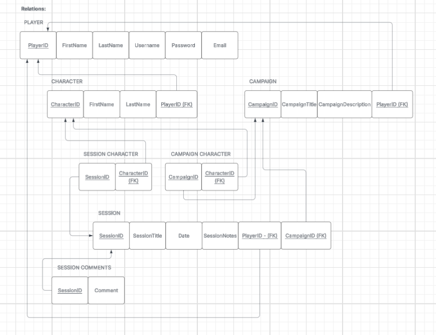

## Description of Project

This project is a platform for users to log DND sessions, including things like the players present, the campaign being played, and session notes. 

## ERD and Business Rules

This diagram shows a simple setup for an app where players can write session logs for the campaigns they’re part of. It connects players, campaigns, and the session logs they create. The goal is to keep track of who wrote each log, which campaign it belongs to, and who’s involved in the campaign overall.

## Relations

This diagram is a cleaner, more detailed version of the system. It breaks everything into separate tables—players, characters, campaigns, sessions, and comments—so the data stays organized and avoids duplicates. Its purpose is to show how all the pieces of a campaign fit together in a well‑structured database.
